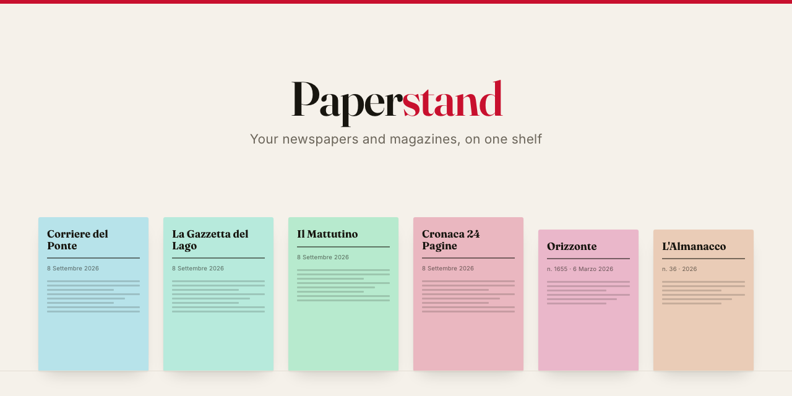
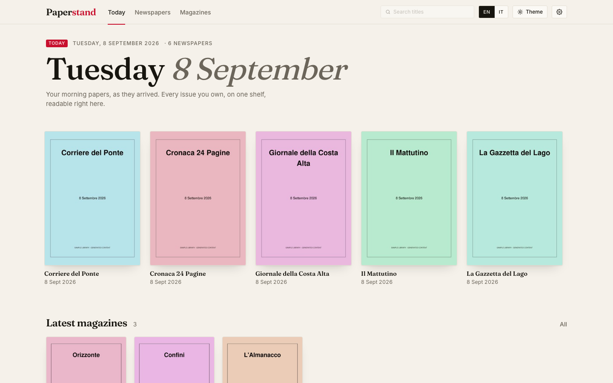
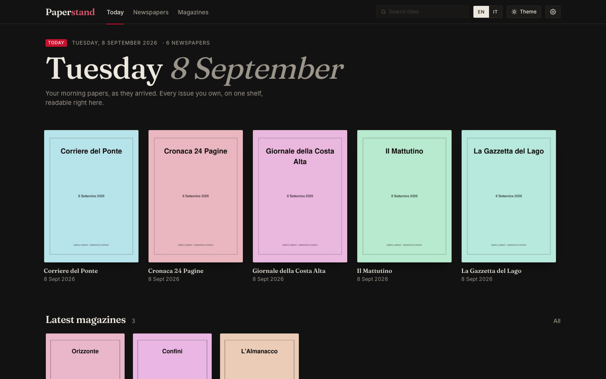
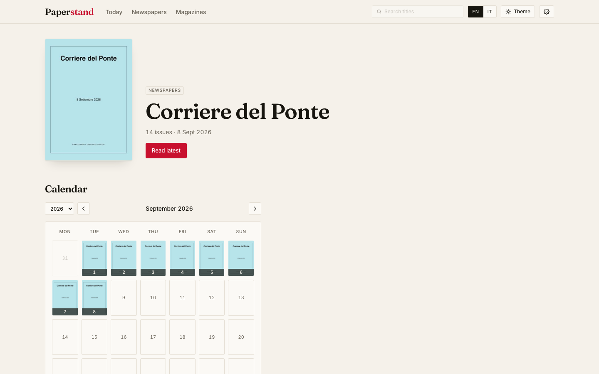
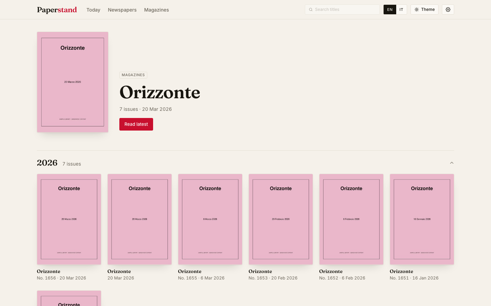
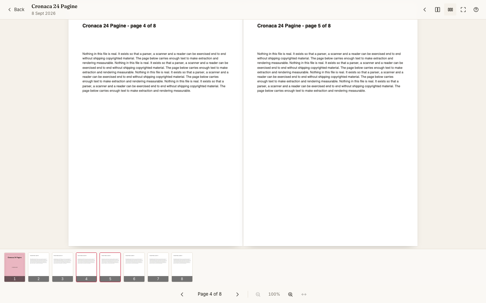
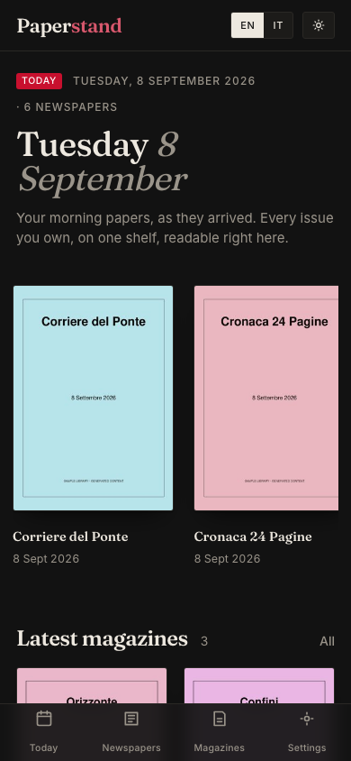

<p align="center">
  
</p>

# Paperstand

[](https://github.com/smashkins/paperstand/actions/workflows/ci.yml)
[](https://github.com/smashkins/paperstand/releases)
[](LICENSE)
[](https://github.com/smashkins/paperstand/pkgs/container/paperstand)
[](backend/pyproject.toml)
[](frontend/package.json)
[](docs/opds.md)

Paperstand is a self-hosted, Docker-first reader for a folder of PDF periodicals. Point it
at a directory you already have — it is mounted read-only and never written to — and it
reads the file names, works out the title and the issue date of each one, and serves a
newsstand: today's papers on the front page, a cover-first shelf per title, a calendar of
back issues, an in-browser reader that streams a 60 MB broadsheet a few hundred kilobytes at
a time, and an OPDS 1.2 feed for the reading app on your phone. Nothing is uploaded
anywhere, nothing calls home, and no naming rule is hard-coded: the parser is driven by
declarative profiles you can extend.

## Screenshots

<table>
  <tr>
    <td width="50%"></td>
    <td width="50%"></td>
  </tr>
  <tr>
    <td></td>
    <td></td>
  </tr>
  <tr>
    <td></td>
    <td></td>
  </tr>
</table>

<sup>Every screenshot is of the generated sample library: the publications are
[fictional](docs/sample-library.md) and the pages are filler text.</sup>

## What it does

- **Reads a folder, read-only.** `/library` is mounted `:ro`. Everything Paperstand writes —
  the catalogue, the covers, the page cache — lives under `/data`.
- **Understands the layouts you already have.** Date folders, one folder per title, one
  folder per year, flat directories, and the messy file names that come with them: numeric
  prefixes, `@handle_` prefixes, duplicate suffixes, Italian and English month names, issue
  numbers with and without a token in front of them.
- **Knows what "today" means.** The front page is the day's newspapers, and falls back to
  the most recent day that has some, saying which day that is.
- **Covers first.** A shelf per title, a calendar of issues for a daily, year sections for a
  magazine, "continue reading" for what you left half-finished.
- **Reads in the browser.** pdf.js over HTTP range requests, one page or two, swipe, pinch,
  double-tap, keyboard shortcuts, a thumbnail strip, and your position remembered per issue.
  A 65 MB broadsheet opens having fetched about a tenth of the file. Needs Chrome 125,
  Safari 18 or a browser of the same generation or newer.
- **Serves OPDS 1.2.** The same catalogue in the reading app on your phone or e-reader.
- **Speaks English and Italian**, light and dark, on a phone, a tablet and a desktop.
- **Small.** One image, under 400 MB, `linux/amd64` and `linux/arm64`, runs as your own uid.

## Quick start

**1. Lay out two folders.** One holds your PDFs; the other is Paperstand's own.

```
paperstand/
├── docker-compose.yml
├── .env
├── library/          ← your PDFs (mounted read-only)
└── data/             ← the database, the covers, the page cache
```

**2. Write a `.env`.** Copy [`.env.example`](.env.example) and set four things:

```dotenv
LIBRARY_PATH=./library      # where your PDFs are
DATA_PATH=./data            # where Paperstand may write
PUID=1000                   # `id -u` — so the files it writes belong to you
PGID=1000                   # `id -g`
TZ=Etc/UTC                  # what "today" means — set your own zone
```

**3. Start it.**

```bash
docker compose up -d
```

**4. Open `http://localhost:8080`.** The first scan starts by itself; the catalogue fills in
as it goes and the covers arrive a few seconds later.

<details>
<summary>Without compose</summary>

```bash
docker run -d --name paperstand -p 8080:8080 \
  -e PUID=1000 -e PGID=1000 -e TZ=Etc/UTC \
  -v /path/to/library:/library:ro \
  -v /path/to/data:/data \
  ghcr.io/smashkins/paperstand:latest
```

</details>

## Configuration

| Variable | Default | What it does |
| --- | --- | --- |
| `LIBRARY_PATH` | `./library` | Host folder holding the PDFs, mounted read-only at `/library` |
| `DATA_PATH` | `./data` | Host folder for the database and the caches, mounted at `/data` |
| `PUID` / `PGID` | `1000` | The user and group the server drops to |
| `TZ` | system | The timezone "today" is decided in |
| `PORT` | `8080` | The published port; the container always listens on 8080 |
| `PAPERSTAND_SCAN_INTERVAL` | `900` | Seconds between automatic scans; `0` switches them off |
| `PAPERSTAND_PAGE_CACHE_MAX_MB` | `2048` | Ceiling on the rendered-page cache |
| `PAPERSTAND_TRUSTED_PROXIES` | `127.0.0.1` | Clients whose `X-Forwarded-*` headers are believed |
| `PAPERSTAND_BASE_URL` | unset | The address the outside world uses, when it cannot be worked out from the request |

**[`docs/configuration.md`](docs/configuration.md)** has the rest — every `PAPERSTAND_*`
variable, and the whole `paperstand.yml` schema.

## Folders and file names

Paperstand does not care how your library is arranged. These all work, and they can be
mixed in one collection:

```
Newspapers/2026/03/17/Corriere_del_Ponte_17_Marzo_2026.pdf   ← date folders
Magazines/Orizzonte/Orizzonte_1655_-_6_Marzo_2026.pdf        ← one folder per title
Magazines/2026/Confini/03/Confini_N_3_Marzo_2026.pdf         ← year and month folders
Zines/Something.pdf                                           ← flat, no date at all
```

A file whose title cannot be worked out is not dropped: it goes into an **Unsorted** shelf,
still readable, with its date and its file name.

Configuring titles is what turns a pile of PDFs into a catalogue — it is how Paperstand
tells `La Gazzetta del Lago` from `La Gazzetta del Lago Valdora`. Two commands show you
exactly what it is doing, and neither touches the database or the cache:

```bash
# One line per PDF: the title, the date, and the rule that decided
docker compose exec paperstand paperstand parse-report /library

# Every step taken on one file, in order
docker compose exec paperstand paperstand parse-explain "/library/Newspapers/2026/03/17/a_file.pdf"
```

See [`docs/folder-layout.md`](docs/folder-layout.md) for the layouts and
[`docs/parser-profiles.md`](docs/parser-profiles.md) for how to teach the parser a shape it
does not know.

## OPDS

The catalogue is also an [OPDS 1.2](https://specs.opds.io/opds-1.2) feed, so the reading app
on your phone or e-reader can browse the same titles and download issues:

```
http://<host>:8080/opds
```

That is the only address a client needs; it discovers the shelves, the covers and the search
box from the feed. Verified with **Panels** and **Chunky** on iOS, and **Moon+ Reader**,
**Librera** and **KOReader** on Android and e-ink.

[`docs/opds.md`](docs/opds.md) has the feed tree, per-client setup, and what to set when the
covers do not appear (almost always a base-URL problem).

## Reverse proxy and authentication

**Paperstand has no authentication of its own.** Anyone who can reach the port can
read the catalogue. Run it on a network you trust, or put a reverse proxy in front of it and
let the proxy ask for a password — HTTP basic auth works with every OPDS client listed
above, which is why it is the recommended shape. There is a worked example, with the
`PAPERSTAND_TRUSTED_PROXIES` and `PAPERSTAND_BASE_URL` settings that go with it, in
[`docs/opds.md`](docs/opds.md#putting-it-behind-a-password).

## FAQ

**Why is this file in Unsorted?**
Because no configured title matched its name. Run `paperstand parse-explain` on it: the
trace shows every rule that was tried. Usually the fix is one line in `paperstand.yml` — the
title itself, or an alias for the spelling that file uses.

**Why does a date look guessed?**
An issue whose date came from the folder or from the file's modification time rather than
from its name carries a small chip saying so. Paperstand never invents precision: a name
that only said "March 2026" is shown as March 2026, not as the first of the month.

**How do I rescan?**
It scans every 15 minutes by default, and once at start-up. *Settings → Rescan now* does it
immediately, and so does `POST /api/scan`. A scan only looks at what changed, so a library
that has not moved costs a directory walk.

**Where is the cache, and how big does it get?**
`/data/cache`: covers and thumbnails from the scanner, rendered pages on demand. Covers are
a few hundred kilobytes an issue. Pages are capped by `PAPERSTAND_PAGE_CACHE_MAX_MB`, 2 GB
by default. Deleting the whole directory is safe at any time — it is rebuilt as things are
asked for.

**Does it handle comics or books?**
No. Paperstand is about periodicals — a masthead, an issue date, "what came out today" — and
it reads PDFs only. For CBZ and CBR use a comic server; for EPUB use a book server. They are
better at those than Paperstand would ever be, and they run happily alongside it.

**Where do the PDFs come from?**
That is your business. Paperstand reads a folder and has no opinion about how it got filled.

## Roadmap

Not there yet, in rough order of interest:

- **OPDS-PSE page streaming**, so a reading app can fetch one rendered page at a time
  instead of downloading the whole PDF. The endpoint it needs already exists.
- **Search in the web interface.** It exists in the feed; the box in the top bar is disabled.
- **Serving under a sub-path**, for a reverse proxy that cannot give Paperstand a hostname.
- **Multiple users**, with a reading position each.
- **Annotations and clippings.**

## Contributing

[`CONTRIBUTING.md`](CONTRIBUTING.md) has the development setup, the make targets and the
checks. `make sample-library` generates about 110 fake PDFs to develop against, so you never
have to work from your own collection.

## License

MIT — see [`LICENSE`](LICENSE).
